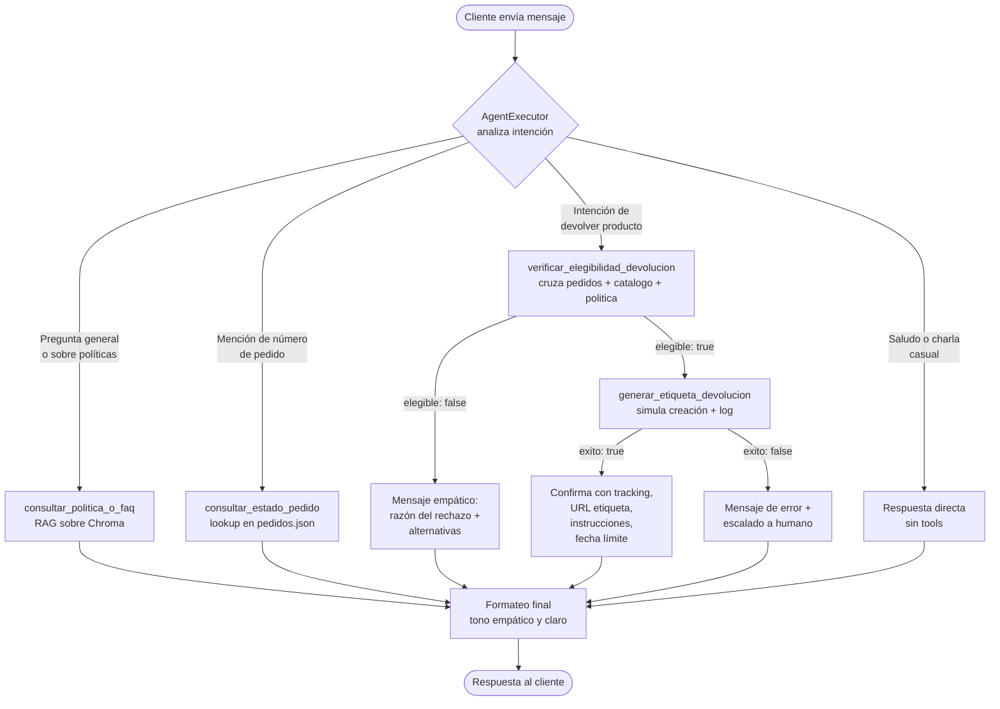

# Fase 1 — Diseño de la Arquitectura del Agente

**Proyecto Final · IA Generativa · Maestría IA Aplicada — Universidad Icesi**

Autores: Josué Cobaleda, Farid Sandoval, Iván Morán

---

## 1. Visión general

El Taller 2 entregó un asistente RAG capaz de responder consultas de los clientes de EcoMarket recuperando información de una base de conocimiento vectorial (políticas, catálogo, FAQ) y, en paralelo, una herramienta determinista para consultas de pedidos por ID. Ese asistente, sin embargo, era **reactivo**: solo respondía preguntas, no podía ejecutar acciones.

El Proyecto Final transforma ese asistente en un **agente proactivo** capaz de tomar decisiones autónomas y ejecutar operaciones reales sobre los sistemas de EcoMarket. La operación específica a automatizar es el **proceso de devolución de productos**, que requiere razonar sobre múltiples fuentes (pedido, catálogo, política), aplicar reglas de negocio y producir un artefacto accionable (etiqueta de devolución).

La estrategia arquitectónica adoptada es:

- Mantener **toda la capacidad del Taller 2** (RAG + consulta de pedidos), pero re-encapsularla como **herramientas del agente**.
- Introducir **dos nuevas herramientas deterministas** que materializan el flujo de devolución (verificación de elegibilidad y generación de etiqueta).
- Delegar al LLM —dentro de un `AgentExecutor` de LangChain— la decisión de qué herramienta invocar, en qué orden, y cómo encadenar resultados.

---

## 2. Extensión de la arquitectura RAG

El enunciado plantea dos opciones para integrar el RAG existente con la nueva capa de agente: (a) tratarlo como **una herramienta más** dentro del agente, o (b) mantenerlo como **ruta alterna** decidida por un router de entrada.

**Decisión adoptada**: el RAG se convierte en **una herramienta** del agente (`consultar_politica_o_faq`), no en una ruta paralela.

### Justificación

| Criterio | RAG como tool (elegida) | RAG como ruta paralela |
|---|---|---|
| **Encadenamiento de razonamiento** | El agente puede combinar RAG con otras tools en un mismo turno (ej.: consultar política → verificar elegibilidad → generar etiqueta) | Aísla el RAG; encadenamiento no es nativo |
| **Mantenibilidad** | Una sola lógica de orquestación (el agente) | Dos rutas con reglas duplicadas |
| **Extensibilidad** | Añadir tools no toca el flujo principal | Cada nueva ruta requiere reglas de routing nuevas |
| **Riesgo de mis-routing** | Bajo: la decisión la toma el LLM con descripción semántica de cada tool | Alto: depende de heurísticas frágiles (regex, keywords) |
| **Trazabilidad** | El AgentExecutor expone `intermediate_steps` con cada tool invocada y su output | Hay que loggear manualmente en cada rama |

La arquitectura router del Taller 2 (regex sobre tracking number → tool determinista; resto → RAG) era apropiada para dos rutas simples, pero **no escala** a un escenario con cuatro o más caminos posibles que pueden encadenarse. El AgentExecutor resuelve elegantemente ese caso.

### Comparativa antes / después

```
TALLER 2 (router manual)                  PROYECTO FINAL (agente)

Pregunta del cliente                      Pregunta del cliente
        │                                         │
        ▼                                         ▼
  Router por regex                          AgentExecutor
        │                                         │
   ┌────┴────┐                          ┌─────────┼─────────┬─────────┐
   ▼         ▼                          ▼         ▼         ▼         ▼
Tool       Cadena                     RAG     Pedidos  Elegibilidad  Etiqueta
pedidos    RAG única                  tool     tool      tool         tool
                                          (encadenables por el LLM)
```

---

## 3. Definición de las herramientas (Tools)

El agente dispone de **cuatro herramientas**. Las dos primeras son re-encapsulaciones del Taller 2; las dos últimas son **nuevas** y satisfacen el requerimiento mínimo del enunciado (mínimo dos tools sin contar la funcionalidad RAG).

### 3.1 `consultar_politica_o_faq` *(reutilizada del Taller 2)*

Encapsula la cadena RAG construida en el taller anterior: embeddings con `intfloat/multilingual-e5-large` + ChromaDB + prompt anti-alucinación.

| Atributo | Valor |
|---|---|
| **Input** | `query: str` — pregunta en lenguaje natural |
| **Output** | `{ "respuesta": str, "fuentes": list[str] }` |
| **Errores** | Si no hay match relevante, devuelve `respuesta` con fallback explícito ("No tengo información sobre eso…") |
| **Side effects** | Ninguno (solo lectura) |
| **Cuándo usarla** | Preguntas generales sobre políticas, productos del catálogo o FAQ |

### 3.2 `consultar_estado_pedido` *(reutilizada del Taller 2)*

Lookup determinista sobre `pedidos.json`.

| Atributo | Valor |
|---|---|
| **Input** | `order_id: str` |
| **Output** | `{ "encontrado": bool, "estado": str, "fecha_pedido": str, "fecha_entrega_estimada": str, "productos": list[dict] }` |
| **Errores** | Si el pedido no existe → `{ "encontrado": false, "mensaje": "Pedido no localizado" }` |
| **Side effects** | Ninguno (solo lectura) |
| **Cuándo usarla** | El cliente menciona explícitamente un número de pedido y pregunta por su estado |

### 3.3 `verificar_elegibilidad_devolucion` *(NUEVA — obligatoria)*

Cruza tres fuentes de información para aplicar reglas de negocio sobre devoluciones.

| Atributo | Valor |
|---|---|
| **Input** | `order_id: str`, `product_id: str` |
| **Output** | `{ "elegible": bool, "razon": str, "dias_restantes": int, "monto_reembolso": float }` |
| **Errores** | `{ "elegible": false, "error": "pedido_no_encontrado" \| "producto_no_en_pedido" \| "fuera_de_ventana" \| "categoria_no_devolvible" }` |
| **Side effects** | Ninguno (solo lectura, pero **prepara** la acción siguiente) |
| **Cuándo usarla** | El cliente expresa intención de devolver un producto específico |

**Lógica determinista (no delega al LLM)**:
1. Buscar el pedido en `pedidos.json`. Si no existe → no elegible.
2. Verificar que el `product_id` esté en el pedido. Si no → no elegible.
3. Calcular días desde la entrega. Si > 30 → fuera de ventana.
4. Buscar el producto en `catalogo_productos.json` y leer su categoría.
5. Si la categoría está en `["perecedero", "higiene_personal"]` → no devolvible (regla de la política).
6. Si todo pasa → elegible, calcular reembolso a partir del precio del catálogo.

Esta separación **lógica de negocio en código, decisión semántica en LLM** es deliberada: minimiza riesgo de alucinación en decisiones con consecuencias económicas (ver Fase 3, riesgos éticos).

### 3.4 `generar_etiqueta_devolucion` *(NUEVA — obligatoria)*

Simula la creación de una etiqueta de envío de retorno.

| Atributo | Valor |
|---|---|
| **Input** | `order_id: str`, `product_id: str`, `email_cliente: str` |
| **Output** | `{ "exito": bool, "tracking_devolucion": str, "url_etiqueta": str, "instrucciones": str, "fecha_limite_envio": str }` |
| **Errores** | `{ "exito": false, "error": "elegibilidad_no_verificada" \| "email_invalido" }` |
| **Side effects** | **Sí** — escribe un registro simulado en `devoluciones_log.json` con timestamp, tracking generado y datos del cliente |
| **Cuándo usarla** | Solo después de que `verificar_elegibilidad_devolucion` haya devuelto `elegible: true` |

**Guard interno**: la tool valida que exista una verificación de elegibilidad reciente para el mismo `(order_id, product_id)` antes de generar la etiqueta. Esto previene que el agente genere etiquetas saltándose la validación (defensa en profundidad contra prompt injection — ver Fase 3).

---

## 4. Selección del marco de agentes: LangChain

**Decisión**: LangChain con `create_tool_calling_agent` + `AgentExecutor`.

### Justificación frente a LlamaIndex

| Criterio | LangChain (elegida) | LlamaIndex |
|---|---|---|
| **Continuidad con el Taller 2** | Total — todo el RAG ya está en LangChain | Requeriría reescribir loaders, splitters y retriever |
| **Madurez del subsistema de agentes** | Núcleo del producto: `AgentExecutor` con tracing, retry, manejo de errores de parsing y límites de iteración integrados | Agentes son una capa secundaria; el foco del producto es retrieval |
| **Catálogo de tool patterns** | Decoradores `@tool`, `StructuredTool`, integración con Pydantic schemas para validación | Más limitado, requiere boilerplate adicional |
| **Observabilidad** | Integración nativa con LangSmith para tracing de cada paso del agente | Requiere instrumentación manual |
| **Ecosistema de integraciones** | Mayor número de loaders, vector stores, LLMs soportados | Comparable en RAG, menor en agentes |

### Implementación específica

Se utiliza **`create_tool_calling_agent`** (no ReAct ni OpenAI Functions legacy) porque:

1. Funciona con cualquier LLM moderno que soporte tool calling vía API estructurada (Gemini, Claude, GPT-4).
2. Es más fiable que ReAct para modelos que tienen tool calling nativo: el modelo emite JSON estructurado en lugar de texto libre con formato `Action: ... Action Input: ...` que puede romperse.
3. El `AgentExecutor` se configura con `handle_parsing_errors=True`, `max_iterations=5` y `verbose=True` para evitar loops infinitos y facilitar el debug en sustentación.

---

## 5. Selección del LLM

A diferencia del Taller 2 (donde un modelo local de 3B parámetros era suficiente para RAG simple), el agente requiere **tool calling robusto**: capacidad consistente de emitir JSON estructurado con los argumentos correctos para cada tool. Modelos pequeños (≤3B parámetros) fallan con frecuencia en esta tarea.

### Comparativa

| Modelo | Tool calling | Costo | Privacidad | Latencia | Decisión |
|---|---|---|---|---|---|
| Ollama `llama3.2:3b` (Taller 2) | Inconsistente | Gratis | Total (local) | ~2-4s | Descartado |
| Ollama `llama3.1:8b` (local) | Aceptable | Gratis | Total (local) | ~5-10s | Plan B |
| **Gemini 2.0 Flash (API)** | **Robusto** | **Gratis (tier generoso)** | Datos transitan a Google | **<1s** | **Elegido** |
| Claude Sonnet 4.5 (API) | Excelente | $3/$15 por MTok | Datos transitan a Anthropic | ~1-2s | Alternativa premium |
| GPT-4o-mini (API) | Excelente | ~$0.15/$0.60 por MTok | Datos transitan a OpenAI | ~1-2s | Alternativa |

### Justificación de Gemini 2.0 Flash

1. **Tool calling de calidad de producción** — el modelo soporta function calling estructurado vía la API de Google AI, con altísima fidelidad de formato.
2. **Costo cero en tier gratuito** — para un proyecto académico con volumen modesto de prompts, el tier gratuito es más que suficiente.
3. **Multilingüismo nativo** — entrenado fuertemente en español, evita el problema de mezcla de idiomas que afectaba al modelo 3B.
4. **Latencia baja** — la "Flash" en el nombre no es solo marketing: respuestas <1s mejoran significativamente la UX del chat.
5. **Sin instalación local** — elimina la fricción del setup de Ollama para evaluadores.

### Plan B: Ollama `llama3.1:8b`

Si por alguna razón (límites de cuota, restricciones de red en sustentación) no se puede usar Gemini, el sistema puede degradarse a Ollama local con `llama3.1:8b`. Esta variante:

- Mantiene privacidad total y costo cero.
- Requiere ~6 GB de VRAM en cuantización Q4 (compatible con la RTX 4050 del equipo).
- Tiene tool calling aceptable aunque menos fiable.
- Se activa cambiando una sola variable de entorno (`LLM_PROVIDER=ollama` vs `LLM_PROVIDER=gemini`), gracias a una factoría de proveedores en `config.py`.

---

## 6. Diagrama de flujo



### Ejemplos de trazas esperadas

**Caso 1 — Pregunta sobre política, sin acción**
```
Cliente: "¿Cuántos días tengo para devolver?"
Agente: → invoca consultar_politica_o_faq("plazo de devolución")
Respuesta: "Tienes 30 días desde la entrega para iniciar una devolución…"
```

**Caso 2 — Devolución encadenada (camino feliz)**
```
Cliente: "Quiero devolver la botella térmica del pedido 1001"
Agente: → invoca verificar_elegibilidad_devolucion(order_id="1001", product_id="P-104")
        → recibe { elegible: true, dias_restantes: 12, monto_reembolso: 45000 }
        → invoca generar_etiqueta_devolucion(order_id="1001", product_id="P-104", email="…")
        → recibe { exito: true, tracking_devolucion: "RET-XYZ123", url_etiqueta: "…" }
Respuesta: "He generado tu etiqueta de devolución. Tracking RET-XYZ123…"
```

**Caso 3 — Devolución rechazada (camino de error)**
```
Cliente: "Quiero devolver el cepillo de bambú del pedido 1002"
Agente: → invoca verificar_elegibilidad_devolucion(order_id="1002", product_id="P-208")
        → recibe { elegible: false, razon: "categoria_no_devolvible: higiene_personal" }
        → NO invoca generar_etiqueta_devolucion
Respuesta: "Lo sentimos, los productos de higiene personal no son devolvibles
            por seguridad sanitaria. ¿Puedo ayudarte con algo más?"
```

---

## 7. Decisiones técnicas y trade-offs

| Decisión | Alternativa descartada | Trade-off aceptado |
|---|---|---|
| RAG como tool del agente | RAG como ruta paralela | +Encadenamiento, +Mantenibilidad / −Una llamada extra al LLM |
| LangChain | LlamaIndex | +Continuidad con Taller 2, +Madurez de agentes / −Acoplamiento a un framework |
| `create_tool_calling_agent` | ReAct prompting | +Fiabilidad de formato / −Requiere LLM con function calling nativo |
| Gemini 2.0 Flash | Ollama local 3B | +Tool calling robusto, +Latencia, +Multilingüe / −Datos salen del entorno local |
| Lógica determinista en tools | Decisiones delegadas al LLM | +Auditabilidad, +Consistencia / −Menos flexible para casos edge |
| Guard de elegibilidad en `generar_etiqueta` | Confianza ciega en el agente | +Defensa en profundidad / −Acoplamiento entre tools |
| `max_iterations=5` | Sin límite | +Previene loops costosos / −Puede cortar razonamientos legítimos largos |

---

## 8. Limitaciones y suposiciones

### Limitaciones conocidas

- **Datos simulados**: `pedidos.json`, `catalogo_productos.json` y la base de conocimiento son fixtures estáticos. En producción se conectarían a sistemas reales (CRM, ERP, CMS) vía API.
- **Etiqueta sin proveedor real**: la tool `generar_etiqueta_devolucion` simula la creación; en producción se integraría con un proveedor de paquetería (Servientrega, Coordinadora, etc.) vía API.
- **Sin autenticación**: el cliente no se autentica antes de operar sobre un pedido. En producción esto sería un riesgo crítico (cualquiera podría devolver pedidos ajenos conociendo el ID).
- **Memoria de conversación volátil**: `ConversationBufferMemory` en `st.session_state` se pierde al recargar la app.
- **Single-tenant**: no hay aislamiento de datos por cliente; todos los usuarios ven el mismo conjunto de pedidos.

### Suposiciones del diseño

- El cliente conoce su `order_id` y el `product_id` o nombre del producto cuando solicita devolución (en producción habría que ofrecer una búsqueda semántica de "qué pedido tengo recientemente").
- La política de devoluciones cabe en el RAG y no cambia frecuentemente (si cambiara a diario, habría que rebuildear el índice).
- El tier gratuito de Gemini cubre el volumen de demos y desarrollo.
- No hay carga concurrente significativa: la demo es single-user, sin necesidad de optimización de throughput.

---

## 9. Referencias internas

- Repositorio Taller 1: <https://github.com/josue-cobaleda/Taller1-IAgenerativa>
- Repositorio Taller 2: <https://github.com/josue-cobaleda/Taller2-IAgenerativa>
- Documentación de tools individuales: ver `tools/*.py` (Fase 2)
- Análisis de riesgos éticos y monitoreo: ver `fase3-analisis.md`
- Despliegue y ejecución: ver `fase4-despliegue.md` y `README.md`
